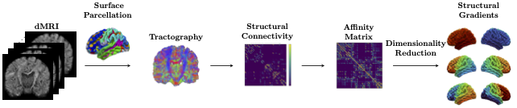

# SCgradients
<div align="center">
    
</div>
This repository provides pytorch implementation of the following paper:

>**Structural Connectome Gradients and Their Relationship to IQ in Early Childhood**

>Yoonmi Hong, Emil Cornea, Jessica B. Girault, Rebecca L. Stephens, Maria Bagonis, Mark Foster, Sun Hyung Kim, Juan Carlos Prieto, Martin A. Styner, and John H. Gilmore <br>
>**Abstract**
The concept of connectome gradients, which represents the continuous spatial variation of brain connectivity, offers a robust framework for exploring the hierarchical organization of the cortex and its relationship with cognitive functions. We hypothesize that structural gradients play a significant role in shaping individual cognitive abilities during early childhood. To evaluate this hypothesis, we employed machine learning approaches to predict the future cognitive outcomes, specifically intelligence quotient (IQ), based on the structural connectome gradients measured at age 1. Our finding indicates that the structural connectome, which undergoes maturation during early childhood, plays a crucial role in the individual variability of IQ observed in early and middle childhood. Our approach underscores the potential of structural gradients as compact and interpretable representations of the complex network of the brain, capturing individual differences that contribute to cognitive development. 

## Usage
```
python3 run_SCgradients_IQ_Destrieux.py
```


